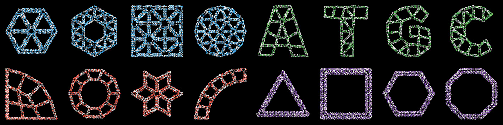

<a name="top"></a>

# METIS

[](https://www.gnu.org/licenses/gpl-3.0.en.html) <br>
[](https://github.com/hmjeon/METIS)
[](https://github.com/hmjeon/METIS)
[](https://github.com/hmjeon/METIS/tags)
[](https://github.com/hmjeon/METIS)

**METIS** is a new, free and open-source software package written in FORTRAN 90/95 that enables the automated convertion of 2D computer-generated design files into DNA sequences. These DNA sequences can be subsequently synthesized and mixed to fold DNA 6HB-based wireframe 2D lattices with high fidelity.

<p align="center"></p>
<!--
reference
-->

+ Pure Fortran library for modern Fortran project
+ Free and open source ([GNU General Public License, version 3.0](https://www.gnu.org/licenses/gpl-3.0.en.html))
+ Fully automatic procedure of the sequence design for scaffolded DNA DX-based wireframe lattices
+ Importing GEO (geometry file format for METIS), [IGS](https://en.wikipedia.org/wiki/IGES), [SVG](https://en.wikipedia.org/wiki/Scalable_Vector_Graphics), or [PLY](https://en.wikipedia.org/wiki/PLY_(file_format)) file formats as an input
+ Exact edge-lengths to design highly asymmetric and irregular shapes
+ [JSON](https://en.wikipedia.org/wiki/JSON) output for editing staple paths and sequences from [caDNAno](https://cadnano.org/)
+ 3D visual outputs by [UCSF Chimera](https://www.cgl.ucsf.edu/chimera/)
+ 23 pre-defined target geometries
+ User-friendly TUI (Text-based User Interface)
+ Online web resources and release packages for Microsoft Windows and Mac OS

---

[Online Portal](#Online-Portal) | [Outputs](#Outputs) | [Compiling Code](#Compiling-Code) | [Copyrights](#copyrights)

---

## Online Portal

[](http://METIS-dna-origami.org)<br>
[```http://metis-dna-origami.org/```](http://metis-dna-origami.org/)

In addition to the source code and pre-compiled binaries available here, we also offer an online web application with all the functionality found in the downloaded version. By submitting the same inputs (PLY, GEO, IGS, or SVG input CAD files), the web service will return the same file output as the downloaded version.

## Outputs

+ The *.csv file generated by METIS contains final staple sequences.
+ The *.bild and *.json generated by METIS can be opened by [UCSF Chimera](https://www.cgl.ucsf.edu/chimera/) and [caDNAno](https://cadnano.org/).
+ The atomic model ([PDB](https://en.wikipedia.org/wiki/Protein_Data_Bank_(file_format))) can be generated by *.cndo file using the [atomic model generator](https://cando-dna-origami.org/atomic-model-generator/) written by Dr. Keyao Pan.

## Compiling Code

[](https://gcc.gnu.org/)
[](https://software.intel.com/en-us/fortran-compilers)
[](https://www.pgroup.com/)
[](https://github.com/hmjeon/METIS)

```git clone https://github.com/hmjeon/METIS.git```

*Requirements to compile from source:*
+ [Intel Fortran compiler](https://software.intel.com/en-us/fortran-compilers): Intel Parallel Studio XE 2016, 2017 or 2018
+ [MATLAB](https://www.mathworks.com): MATLAB 2014, 2015, 2016, 2017 or 2018
+ [Python 2.7](https://www.python.org/): Not compatible with Python 3
+ [Shapely 1.6.4](https://pypi.org/project/Shapely/): Python package, Shapely is used to convert a set of lines to polygon meshes
+ [DistMesh](http://persson.berkeley.edu/distmesh/) or [PyDistMesh 1.2](https://pypi.org/project/PyDistMesh/): DistMesh (MATLAB version) or PyDistMesh (Python version) is used to generate internal triangular meshes
+ Compiling the METIS sources require [Intel Fortran](https://software.intel.com/en-us/fortran-compilers). Free Intel (R) Software Development Tools are available for qualified students, educators, academic researchers and open source contributors, see the [details](https://software.intel.com/en-us/qualify-for-free-software/).
+ The Intel Fortran compiler supports all of the features of the Fortran 90, Fortran 95, Fortran 2003 standards and most of Fortran 2008. It also supports some draft Fortran 2018 features.
+ We provide [MakeFile](./make/makefiles/Makefile) which is a simple way to organize code compilation of METIS.


## Copyrights

*Author*<br>
Dr. Hyungmin Jun ( [Personal web](http://hyungminjun.com) | [e-mail](mailto:hyungminjun@outlook.com) )

*License*<br>
METIS is an open-source software distributed under the [GPL license, version 3](https://www.gnu.org/licenses/gpl-3.0.en.html/)

Anyone is interest to use, to develop or to contribute to METIS is always welcome!

Go to [Top](#top)
